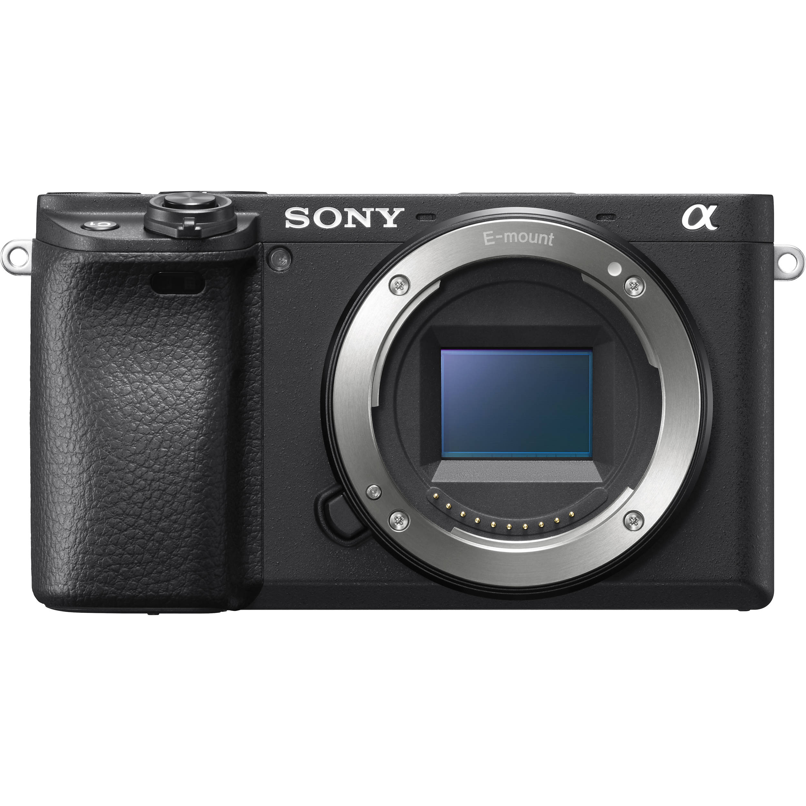
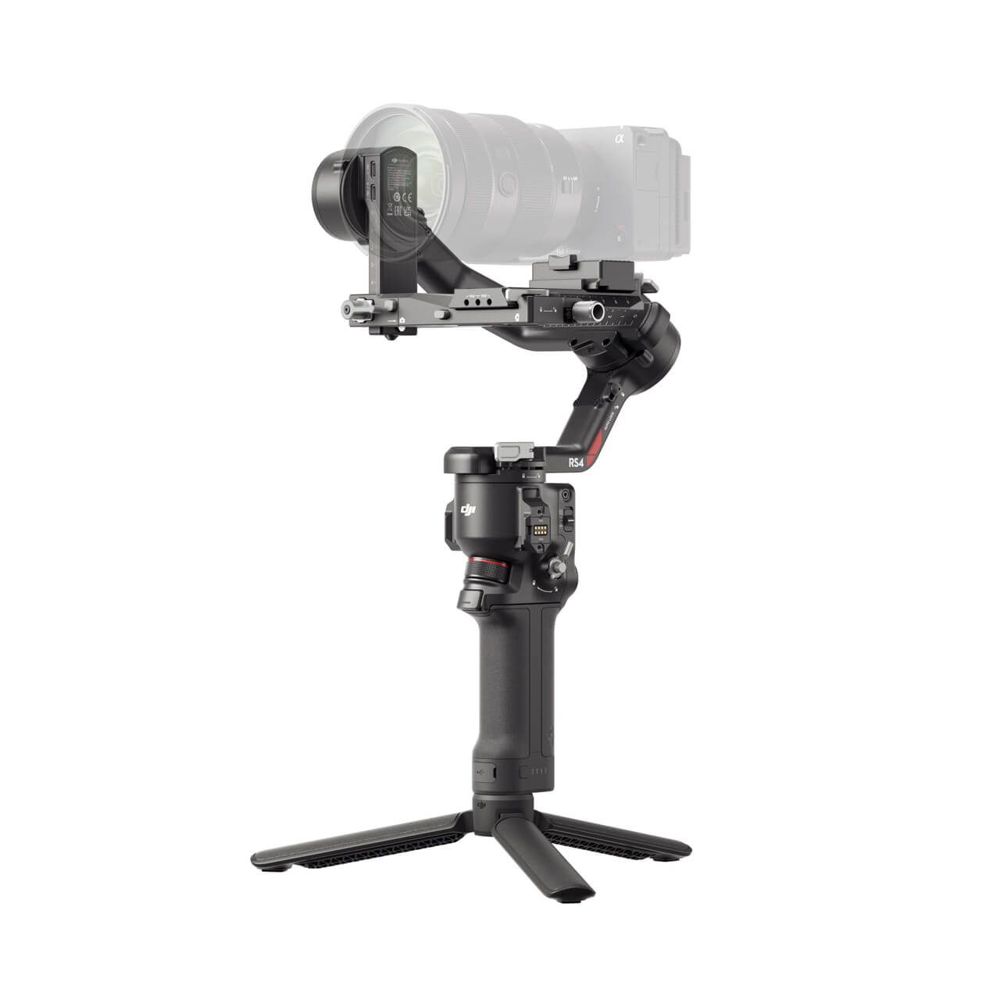
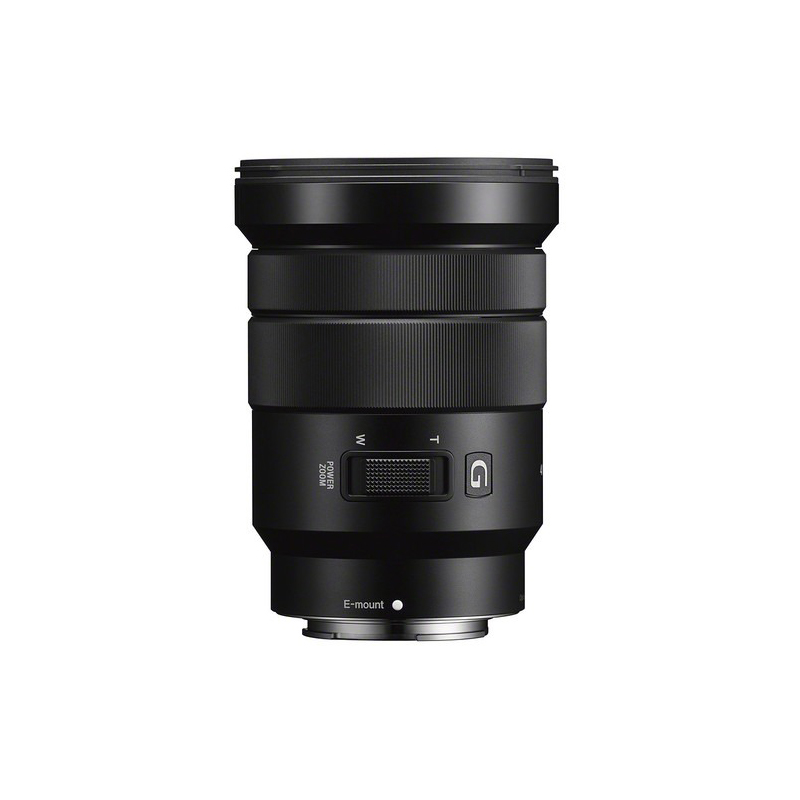

<!DOCTYPE html>
<html lang="vi">
<head>
	<		.container {
			max-width: 1200px;
			margin: 40px auto;
			background: #111;
			border-radius: 16px;
			box-shadow: 0 4px 24px rgba(0,0,0,0.2);
			padding: 32px 24px;
			position: relative;
			overflow: hidden;
		}
		.container::before {
			content: '';
			position: absolute;
			top: 0;
			left: 0;
			width: 100%;
			height: 4px;
			background: linear-gradient(to right, #1a1a1a, #333);
		}
		h1 {
			text-align: center;
			color: #fff;
			font-size: 2em;
			margin-bottom: 32px;
			letter-spacing: 1px;
		}
		   .device-list {
			   display: grid;
			   grid-template-columns: repeat(auto-fill, minmax(300px, 1fr));
			   gap: 24px;
			   padding: 0 8px;
		   }vice-img {
			   width: 120px;
			   height: 90px;
			   background: #1a1a1a;
			   border-radius: 8px;
			   margin-bottom: 0;
			   margin-right: 16px;
			   display: flex;
			   align-items: center;
			   justify-content: center;
			   flex-shrink: 0;
			   overflow: hidden;
		   }
		   .device-img img {
			   width: 100%;
			   height: 100%;
			   object-fit: cover;
			   object-position: center;
			   border-radius: 8px;
			   transition: transform 0.3s ease;
		   }
		   .device-img:hover img {
			   transform: scale(1.05);
		   }name="viewport" content="width=device-width, initial-scale=1.0, maximum-scale=1.0, user-scalable=no">
	<meta name="theme-color" content="#111111">
	<title>H248 Equipment Rental - Cho thuê thiết bị</title>
	
</head>
<body>
	<header style="padding: 20px 0; background: #111; box-shadow: 0 4px 18px rgba(0,0,0,0.10); margin-bottom: 18px;">
		

			

				
				

					

						<svg xmlns="http://www.w3.org/2000/svg" class="contact-icon" style="stroke: #fff;" viewBox="0 0 24 24" stroke-linecap="round" stroke-linejoin="round">
							<path stroke="none" d="M0 0h24v24H0z" fill="none"/>
							<path d="M5 4h4l2 5l-2.5 1.5a11 11 0 0 0 5 5l1.5 -2.5l5 2v4a2 2 0 0 1 -2 2a16 16 0 0 1 -15 -15a2 2 0 0 1 2 -2" />
						</svg>
						<a href="tel:0395413371" style="color: #fff; text-decoration: none;">0395413371 / 0347041474</a>
					

					

						<svg xmlns="http://www.w3.org/2000/svg" class="contact-icon" style="stroke: #fff;" viewBox="0 0 24 24" stroke-linecap="round" stroke-linejoin="round">
							<path stroke="none" d="M0 0h24v24H0z" fill="none"/>
							<rect x="3" y="5" width="18" height="14" rx="2" />
							<polyline points="3 7 12 13 21 7" />
						</svg>
						<a href="mailto:h248production@gmail.com" style="color: #fff; text-decoration: none;">h248production@gmail.com
                        </a>
					

					

						<svg xmlns="http://www.w3.org/2000/svg" class="contact-icon" style="stroke: #fff;" viewBox="0 0 24 24" stroke-linecap="round" stroke-linejoin="round">
							<path stroke="none" d="M0 0h24v24H0z" fill="none"/>
							<circle cx="12" cy="12" r="9" />
							<polyline points="12 7 12 12 15 15" />
						</svg>
						8:00 - 18:00
					

					

						<svg xmlns="http://www.w3.org/2000/svg" class="contact-icon" style="stroke: #fff;" viewBox="0 0 24 24" stroke-linecap="round" stroke-linejoin="round">
							<path stroke="none" d="M0 0h24v24H0z" fill="none"/>
							<circle cx="12" cy="11" r="3" />
							<path d="M17.657 16.657l-4.243 4.243a2 2 0 0 1 -2.827 0l-4.244 -4.243a8 8 0 1 1 11.314 0z" />
						</svg>
						Ngách 82/122, ngõ 166 Kim Mã, Ba Đình, Hà Nội
					

				

			

		

	</header>
	

		

			   

				   

				   

					   
Sony Alpha A6400

					   
300.000 VNĐ/ngày

					   
Phụ kiện: 2 x pin FZ50, 1 x Thẻ nhớ 64G

				   

			   

			   

				   

				   

					   
DJI Ronin RS4

					   
 350.000 VNĐ/ngày
 
					   
Phụ kiện: 1 x tay ngang, 1 x cable type C

				   

			   

			   

				   

				   

					   
Lens Sony 18-105mm F4

					   
200.000 VNĐ/ngày

					   
Phụ kiện: filter chống bụi

				   

			   

			   

				   

				   

					   
Micro Comica VM30

					   
200.000 VNĐ/ngày

					   
Phụ kiện: 1 x dây micro sang XRL

				   

			   

			   

				   

				   

					   
Tripod Triopo

					   
80.000 VNĐ/ngày

					   

				   

			   

			   

				   

				   

					   
Cần boom 3m

					   
100.000 VNĐ/ngày

					   

				   

			   

			   

				   

				   

					   
Đèn Led cầm tay

					   
50.000 VNĐ/ngày

					   

				   

			   

			   

				   

				   

					   
Hắt sáng

					   
20.000 VNĐ/ngày

					   

				   

			   

		

	

	<footer style="margin-top: 32px; background: #111; color: #fff; text-align: center; padding: 18px 0 12px 0; font-size: 1em;">
		© 2025 · H248 Equipment Rental · Hieu KL
</body>
</html>
